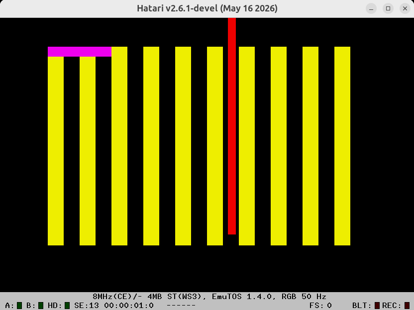

## About:
Running this code will produce an image like the folowing example from Hatari:  
  
The purple field is wakestate+1 column wide (1 if STE, 5 if failed).  
The red bar is drawn using the jitter free vbl: "vbl_irq" in "hw_detect.s", and should always be at that specific position regardless of ST/STE/wakestate.  
  
## Inner workings:
The VBL and the HBL interrupts on the ST/STE are timed to the vertical and horizontal synchronization of the raster beam.  
Normally, the interrupts occur as soon as the CPU have finished the current instruction, wich means that a random delay is added to the time the interrupt routine is actually called. This is what we call "jitter".  
As instructions can take various amount of clock cycles - everything from 4 for a simple move to 164+ for a division, this jitter can be quite substantial.  
This jitter can be minimized by making sure that nothing is running on the cpu outside the VBL/HBL interrupts. This is done by turning off all other interrupts - like the MFP, and the issue a stop command. This is done in the function "main_loop" in "main_asm.s".  
But this will still cause some jitter. It turns out that the 68000 cpu only calls interrupt functions every E clock cycle.  
The E clock is a signal that the cpu uses to talk with some external circuits. On the ST/STE, this is the keyboard and midi ACIA's, and the E clock is 1/10 of the cpu clock.  
So the E clock repeats every 10 cpu cycles, and the ST/STE memory cycles is 4 cpu cycles, means that the relation between E clock and memory cycles is 20 cpu cycles or 5 memory cycles. And that is the reason why the jitter pattern will repeat every five interrupts.  
To stabilize the jitter from the E clock, we need to know at what position in the jitter pattern we are. And it turns out that it is not that hard to do. Simply reading from any of the ACIA's two times and measuring the time each read takes, will give a unique number for how the cpu currently is aligned to the E cycle. The example code uses this to calculate the E clock alignment to the VBL interrupt, but it could as easily be used for the HBL interrupt.  
The E clock timing is done in the function: "analyze_hardware_state" in "hw_detect.s".  
If we are running on STE, then we are done now. But if we are running on the older ST, then we also have to take care of wakestates.  
Wakestates are a quirk in the ST hardware where the GLUE and the SHIFTER have four combined states that they can start up in. This is completely random and cannot be affected in any way, and it affects how the E clock is measured and how the jitter is removed.  
Detecting wakestates is a too big of a topic to describe here, and a lot of people have spent a lot of time researching it. See references below for further information.  
When we know the wakestate and the jitter position of the E clock, then for every VBL we want to stabilize, we just need to delay a known number of memory cycles and update the jitter position. In the example code, this looks like this in "hw_detect.s":  
```
vbl_irq:
	move.w	#0x2700, sr
	movem.l	d0-d4/a0, -(a7)
	move.l	ws_ptr, a0		| The row in e_delay for the detected wakestate.
	add.w	e_frame, a0	| E cycle frame.
	move.b	(a0), d0		| Fetch the delay needed for this E cycle frame.
	lsl.l	d0, d0			| Delay.

/*
	At this point, we are synced to the raster beam.
	Draw a vertical color bar.
*/
	moveq	#0, d0
	move.w	#0xf00, d1
	lea		0xffff8240.w, a0

	move.w	#250, d2
1:
	WaitNops	121, d4
	move.w	d1, (a0)
	move.w	d0, (a0)
	dbra	d2, 1b

/*
	Update E clock frame counter.
	This is done at the end as its use of clock cycles varies.
	Missing updating this counter will break raster beam sync to vbl irg.
*/
	move.w	e_frame, d0
	addq.w	#1, d0
	cmp.w	#5, d0
	bne.s	1f
	moveq	#0, d0
1:
	move.w	d0, e_frame
	movem.l	(a7)+, d0-d4/a0
	rte
```

## References:
[Atari-Forum thread](https://www.atari-forum.com/viewtopic.php?f=16&t=24855&start=147)  
[Troed - Atari ST wakestate detection](https://codeberg.org/troed/WSDETECT)  
[OSSC visibility tests on Atari ST/e](https://ae.dhs.nu/hatari_overscan/)  
[Atari-Wiki ST_STE_Scanlines](https://www.atari-wiki.com/?title=ST_STE_Scanlines)  


